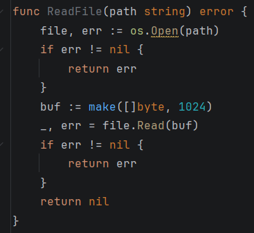

在最后再关闭很容易忘记

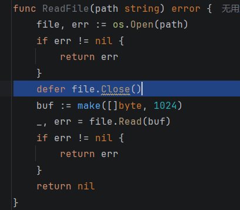

再看看go怎么读取一个文件

假设有这样的文本文件

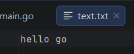

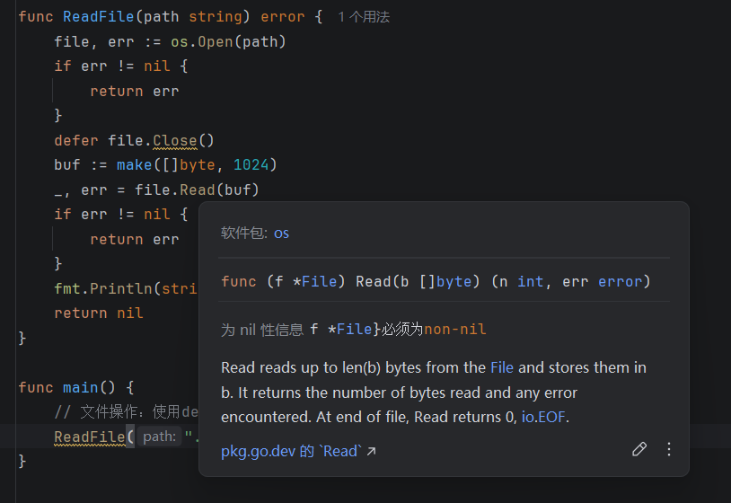

查看Read文档，n int没有用，直接用

结果是

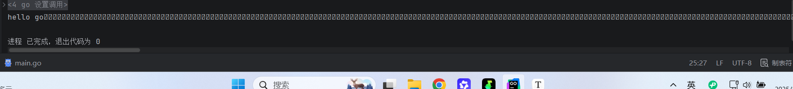

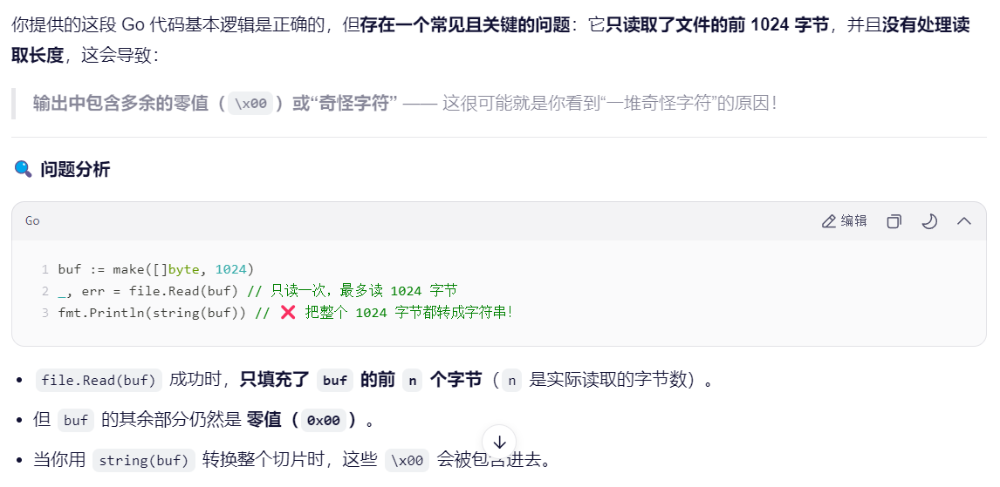

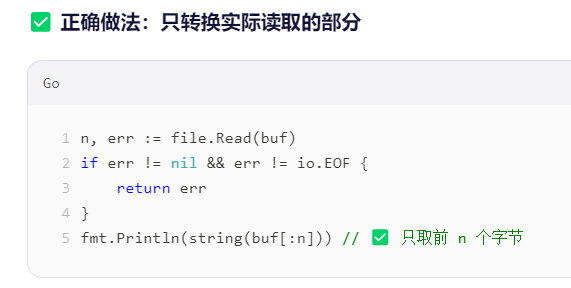

说明这个n还是有用的，是实际的字节数

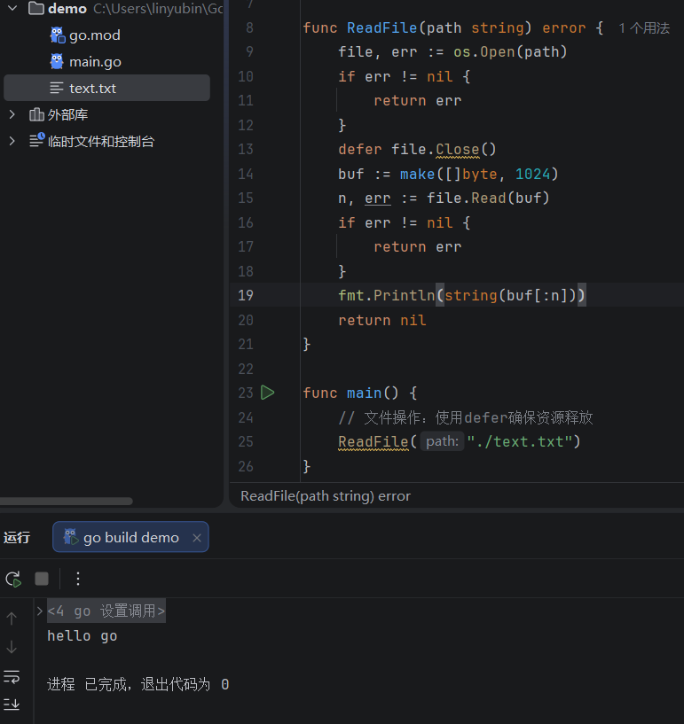

ai说这样处理文件有更大的问题，题外话：这个路径前面其实可以省略

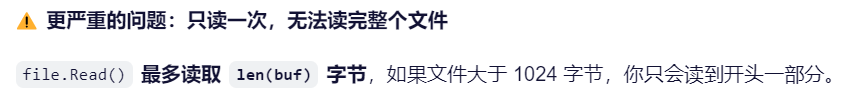

验证一下

搞一个大于1024字节的文本，随便copy一个内置函数源码

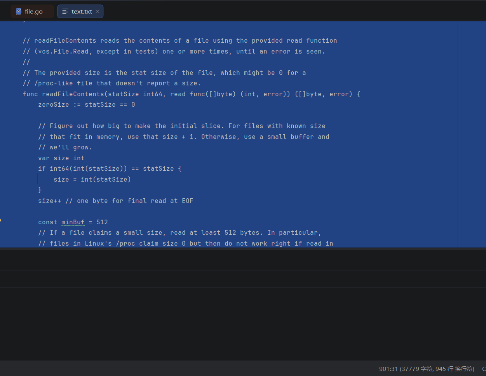

结果


真的只有前面1024个字节

循环读取

```go
package main

import (
	"fmt"
	"io"
	"os"
)

func ReadFile(path string) error {
	file, err := os.Open(path)
	if err != nil {
		return err
	}
	defer file.Close()
	for {
		buf := make([]byte, 1024)
		n, err := file.Read(buf)
		if n > 0 {
			fmt.Print(string(buf[:n]))
		}
		if err != nil {
			if err == io.EOF {
				break
			}
			return err
		}
	}
	return nil
}

func main() {
	err := ReadFile("text.txt")
	if err != nil {
		fmt.Println(err)
	}
}

```

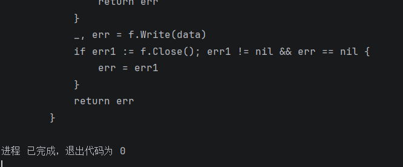

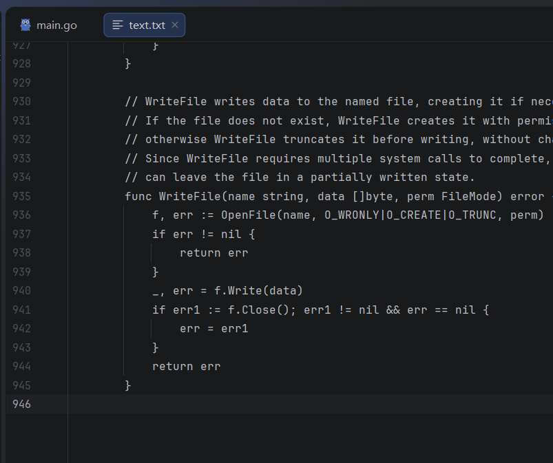